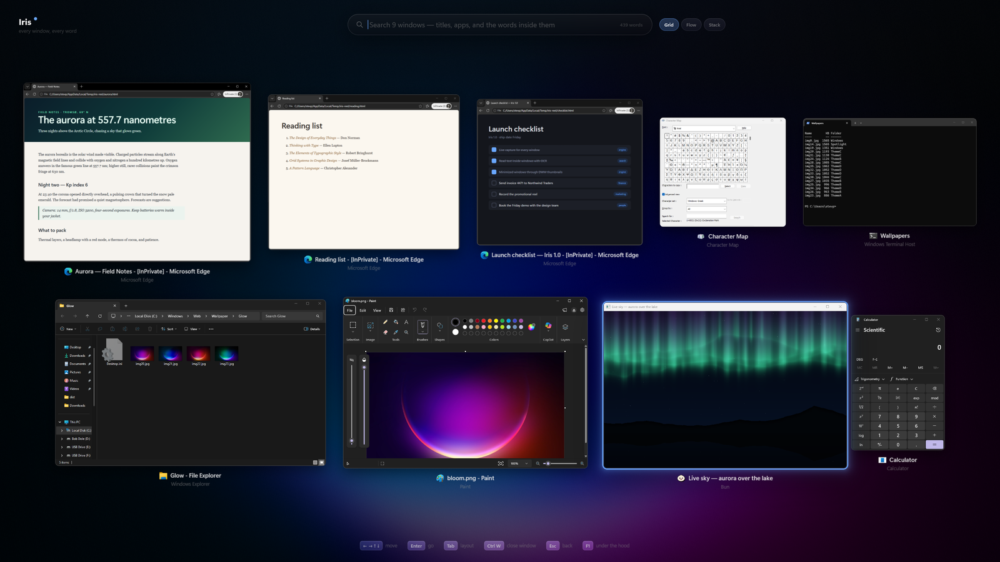
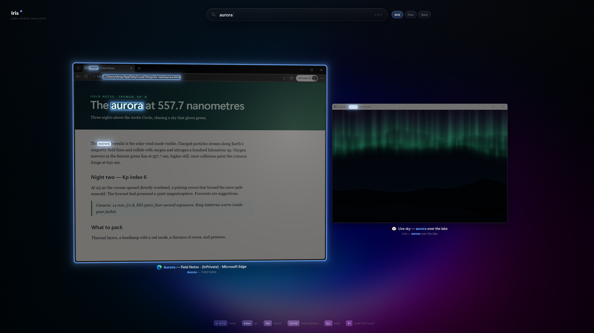
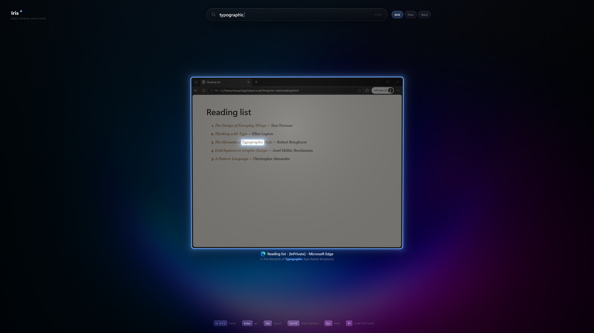
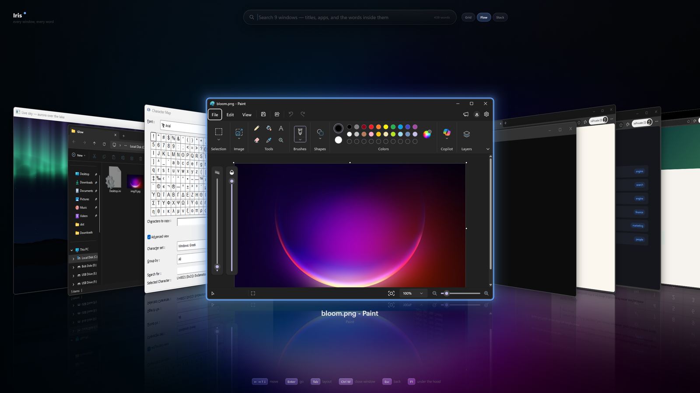
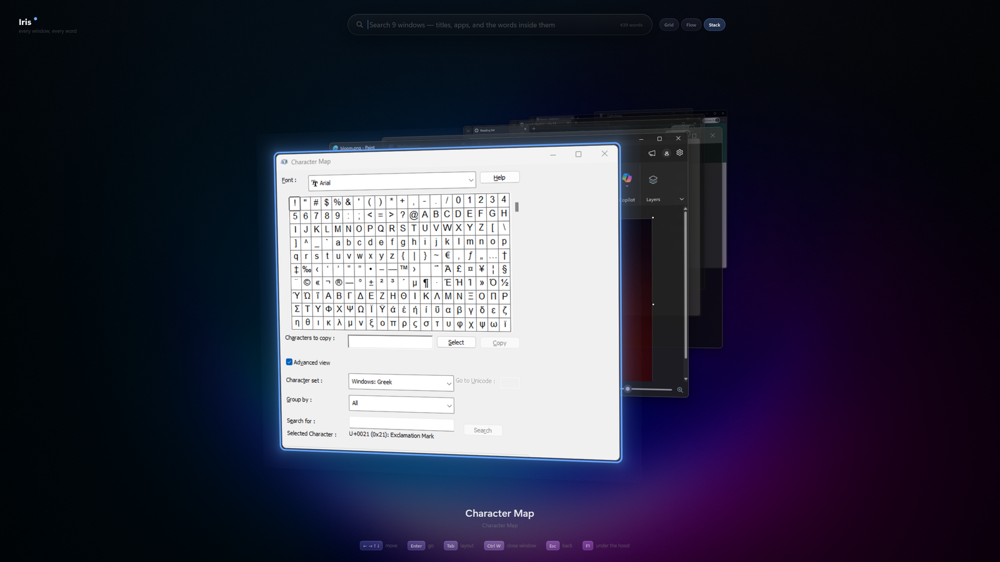
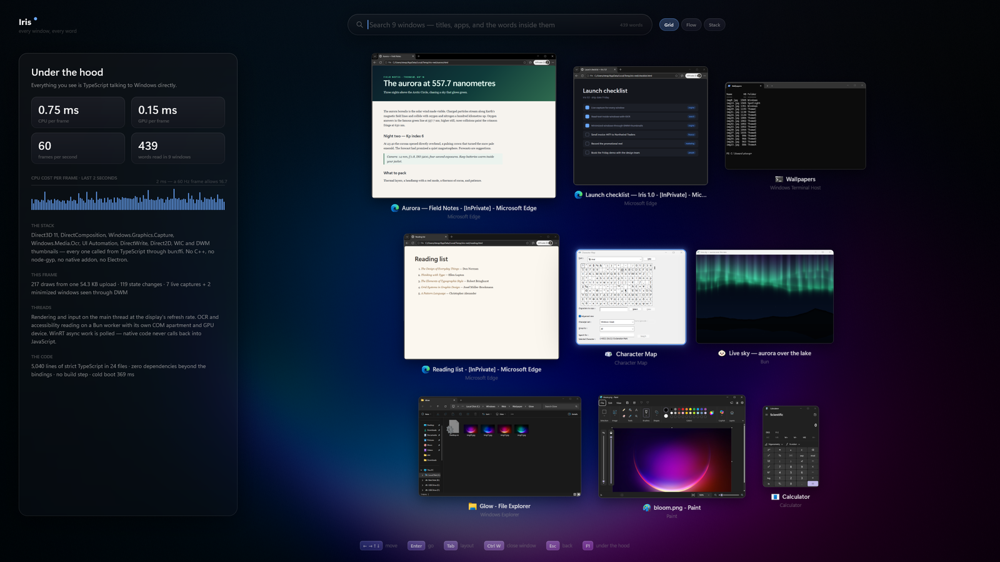

<div align="center">

# Iris

**Every window. Every word.**



</div>

Press **Alt+`** and every open window lifts off your desktop into a living gallery. The cards are not screenshots: video keeps playing, terminals keep scrolling, the aurora in the corner keeps dancing. Start typing and Iris searches the titles, the apps, **and the words inside every window** — minimized ones included — lighting up each match on the live card itself. Choose one and it flies back to exactly where it lives, already focused.

Iris is a spatial window switcher for Windows 11, and it is about 5,000 lines of TypeScript running on [Bun](https://bun.sh). There is no C++, no native addon, no Electron, and no build step: it talks to Direct3D 11, DirectComposition, Windows.Graphics.Capture, Windows.Media.Ocr, UI Automation, DirectWrite, Direct2D, WIC and DWM directly through `bun:ffi` and the [`@bun-win32`](https://github.com/ObscuritySRL/bun-win32) bindings.

```bash
bun run packages/iris/index.ts
```

It opens immediately, then stays resident: **Alt+`** summons it, **Ctrl+C** in its console quits.

| Key | |
| --- | --- |
| *type* | search titles, apps, and the text inside windows |
| ← → ↑ ↓ · Home · End | move the selection |
| Enter · click | go to the window |
| Tab · Shift+Tab | Grid → Flow → Stack |
| Ctrl+W · middle-click | close the selected window (it may still ask to save) |
| Esc | clear the search, then dismiss |
| F1 | under the hood |

## Search that reads



Iris reads every window with on-device OCR (Windows.Media.Ocr) on a background thread, about 30–250 ms per window, and keeps every word with its position. A search matches titles and app names fuzzily and window contents by word, then dims the card and draws a glowing outline around each hit, on the live pixels, at the position where the word actually sits. The line it came from appears under the title.

## Even minimized windows



A minimized window has no pixels to capture, but the Desktop Window Manager keeps the full-size bitmap it uses for taskbar previews. Iris registers DWM thumbnails of minimized windows into a host window of its own that is cloaked and parked at −32000 so no one ever sees it. It captures that host and gives every minimized window its real last frame. The OCR worker does the same at native resolution, so minimized windows are searchable too. When even that is unavailable, UI Automation reads the window's accessibility tree instead.

## Three ways to look

| Grid | Flow | Stack |
| --- | --- | --- |
|  |  |  |
| One uniform scale so relative sizes stay truthful, rows chosen to maximise it, and windows ordered by where they sit so each travels the shortest path. | Cover Flow on a reflective floor: the focused window faces you, the rest turn away. | Most recent first, receding into depth. Scrolling walks back through your session. |

Switching layouts is only a change of spring targets, so every card flies from wherever it is to wherever it belongs, and you can interrupt it mid-flight.

## Under the hood



**F1** opens a colophon measured live: CPU and GPU time per frame (D3D11 timestamp queries, read back without stalling), a frame-time graph, draws, upload size, words read, and the line count of the TypeScript running it.

On an RTX 4090 at 5120×1440 a frame costs about **0.3 ms of CPU and 0.1 ms of GPU**, and a warm start is ready in about **300 ms**.

### How it works

- **Frame zero is your desktop.** The overlay is a `WS_EX_NOREDIRECTIONBITMAP` window whose pixels come from a premultiplied-alpha DirectComposition swap chain, so everything Iris does not paint is the live desktop underneath. The camera is built so the z = 0 plane maps 1:1 onto screen pixels, which means a card at its "home" transform covers its real window exactly. Opening starts from that pixel-identical frame and lifts off in a wave from the pointer. Closing lands back on it, and only then does the overlay disappear.
- **Live pixels.** Each window has a Windows.Graphics.Capture session (borderless, cursorless) feeding a free-threaded frame pool that Iris *polls*. No native callback ever re-enters JavaScript. The newest frame is copied into a mip-mapped texture, so a 2560-pixel window shrunk to a 600-pixel card stays crisp. Sessions stay warm while Iris is hidden, which is why it summons instantly.
- **One upload per frame.** Every draw is a 256-byte record in one structured buffer written with a single `Map(WRITE_DISCARD)`. A draw costs at most a shader switch, a texture bind and `DrawInstanced(4, 1, 0, i)`, where the record index arrives through a per-instance vertex stream offset by `StartInstanceLocation`. `SV_VertexID` and `SV_InstanceID` both ignore start offsets, so that stream is the only way to get it. Cards are signed-distance rounded rectangles with screen-space anti-aliasing under full perspective, analytic Gaussian shadows, a rim light, pointer-following glare and the search highlights, all in one pixel shader.
- **Typography on the GPU.** DirectWrite shapes text and Direct2D rasterises it straight into a texture atlas on the same D3D11 device, using Segoe UI Variable with colour emoji. Search matches are re-weighted and re-coloured per character range inside a single layout.
- **Reading on a worker.** OCR and accessibility run on a Bun worker with its own COM apartment and GPU device. Captured frames go GPU → staging → a WinRT `IBuffer` by native memcpy, with no JavaScript byte loops. Windows larger than the engine's limit are read in overlapping tiles so small text keeps full resolution. `RecognizeAsync` is polled.
- **Motion.** Every animated value is a damped spring solved in closed form, so a 4 ms frame and a 50 ms hitch land on the same curve and retargeting mid-flight never jerks.

| Module | Responsibility |
| --- | --- |
| `app.ts` | the state machine, choreography, input, and per-frame draw list |
| `renderer.ts` · `shaders.ts` · `geometry.ts` | D3D11 pipeline, HLSL, row-vector transforms and hit-testing that match the shader exactly |
| `device.ts` · `window.ts` | the device, the DirectComposition swap chain, the overlay window |
| `capture.ts` · `thumbnails.ts` | live window capture, and the DWM-thumbnail host for minimized windows |
| `ocr.ts` · `accessibility.ts` · `indexer.ts` · `indexer-worker.ts` | reading windows off the render thread |
| `search.ts` | fuzzy title/app matching and positional content search |
| `layout.ts` · `motion.ts` | Grid, Flow, Stack, and the springs that move between them |
| `text.ts` · `icons.ts` · `theme.ts` · `wallpaper.ts` | type, shell icons, the accent palette, the blurred-wallpaper backdrop |
| `windows.ts` · `winrt.ts` · `native.ts` | the window census, WinRT/COM plumbing, a few local FFI shims |
| `recorder.ts` · `index.ts` | real-footage recording and the entry point / resident loop / scripted driver |

## Why TypeScript

The interesting thing about Iris is not that it is fast. Iris is a desktop compositor effect, a GPU renderer, a WinRT capture client, an OCR pipeline and an accessibility reader. Each would normally mean a C++ project with a build system. Here they are TypeScript modules you can read top to bottom, type-checked end to end, that start in a few hundred milliseconds and run one source file at a time. The native APIs are the same ones the shell uses; the language just stopped being the obstacle.

## Recording real footage

Iris can drive itself and record what it renders: the back buffer is read before `Present` and piped into ffmpeg as H.264 at a fixed 60 fps, or saved as full-resolution PNG stills.

```bash
IRIS_SCRIPT="open; wait 1.5; shot grid; type invoice; wait 1; shot search; key tab; wait 1.2; shot flow; quit" bun run packages/iris/index.ts
```

Commands: `open`, `wait <s>`, `settle <s>` (wait for reading to finish), `type <text>`, `key <tab|enter|escape|left|…|ctrl+w>`, `glide <x0> <y0> <x1> <y1> <s>`, `hover <title>`, `choose <title>`, `record <name> <note…>` / `stop`, `shot <name>`, `quit`. Environment: `IRIS_RECORD` (output folder), `IRIS_MONITOR` (`x,y,w,h` region), `IRIS_ONLY_HWNDS`, `IRIS_ONLY_PIDS`, `IRIS_WALLPAPER`, `IRIS_CLEAN_UNDERLAY`, `IRIS_VISIBLE`, `IRIS_NO_INDEX`.

[`example/reel.ts`](./example/reel.ts) stages a privacy-safe desktop of neutral windows, including [`example/live-sky.ts`](./example/live-sky.ts), a live aurora shader in an ordinary framed window. It records the full promotional sequence, then closes every window it opened.

## Requirements and limits

- Windows 11 (borderless capture), Bun ≥ 1.1, any Direct3D 11 GPU, and an OCR language for your Windows display language.
- DRM-protected content captures black, which is Windows policy. Windows of elevated apps may not be capturable from a non-elevated Iris.
- Iris opens on the monitor under the pointer. Windows on other monitors fly in from their real positions.
- While resident, Iris keeps one capture session and one mip-mapped texture per window. That is the cost of an instant summon.
